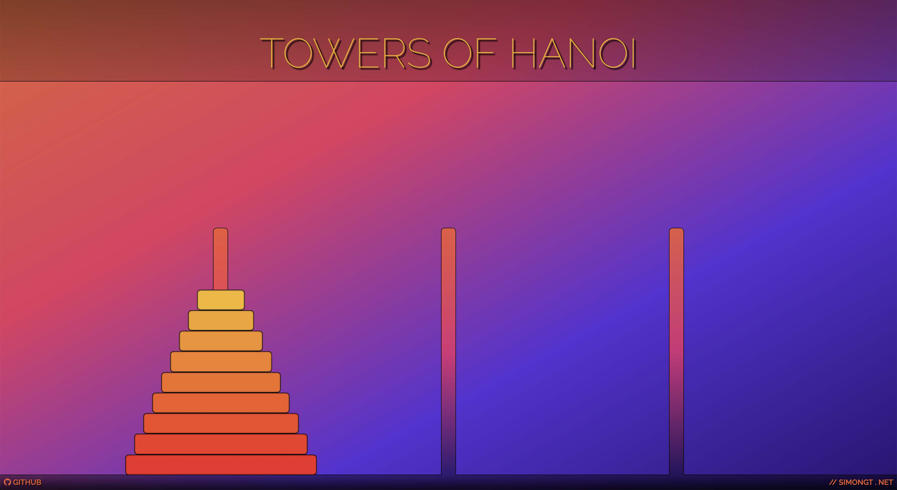

# Towers of Hanoi

<table>
  <tr>
    <td>
      In this project, I use <a href="https://reactjs.org/">React</a>, <a href="https://redux.js.org/">Redux</a>, <a href="https://developer.mozilla.org/en-US/docs/Web/CSS/CSS_Grid_Layout">CSS Grid Layout</a> and the <a href="http://react-dnd.github.io/react-dnd/docs">React DnD</a> API to build a clone of the classic math puzzle, <a href="https://en.wikipedia.org/wiki/Tower_of_Hanoi/">Towers of Hanoi</a>.
    </td>
  </tr>
</table>

<p align="center">
  <a href="https://simongt.github.io/towers-of-hanoi/">
    
  </a>
</p>

## Game Objective

Towers of Hanoi consists of three towers and at least three disks of different sizes, which can slide onto any tower. The puzzle starts with the disks in a neat stack in ascending order of size on one tower, the smallest at the top, thus making a conical shape.

The objective of the puzzle is to move the stack to another tower following these simple rules:
* Only one disk can be moved at a time.
* Each move consists of taking the upper disk from one of the stacks and placing it on top of another stack or on an empty tower.
* No larger disk may be placed on top of a smaller disk.

<p align="center">
  <a href="https://en.wikipedia.org/wiki/Tower_of_Hanoi/">
    
  </a>
</p>

---

# Implementation

## Analysis

Before attempting to code the solution, my first step is break the problem down into smaller, easier-to-manage parts. Then, I prioritize the project's features.

<details>
<summary>
This analytic approach is modeled by one of Dan Abramov's <a href="http://react-dnd.github.io/react-dnd/docs/tutorial">tutorials</a>.
</summary>
Dan Abramov – the creator of Redux, Create React App, React DnD – published a <a href="http://react-dnd.github.io/react-dnd/docs/tutorial">chessboard tutorial</a> (where a lonely knight simply moves about the chess board) that inspired much of the analytical process for this project's undertaking. It's also how I came to explore React's drag-and-drop capabilities.
</details>
<br>

### Identify components, consider props and where state will live.

<table>
  <tr>
    <td>
      <strong>Components</strong>
    </td>
    <td>
      <strong>Description</strong>
    </td>
    <td>
      <strong>Props</strong>
    </td>
  </tr>
  <tr>
    <td>
      <strong><code>Disk</code></strong>
    </td>
    <td>
      A single disk.
    </td>
    <td>
      Disk belongs to a tower and are stacked on other disks. Probably needs no props since the towers will be aware of its rank (size).
    </td>
  </tr>
  <tr>
    <td>
      <strong><code>DiskWrapper</code></strong>
    </td>
    <td>
      <em>Smart</em> wrapper that handles disk logic (e.g. drag-and-drop source).
    </td>
    <td>
      -
    </td>
  </tr>
  <tr>
    <td>
      <strong><code>Tower</code></strong>
    </td>
    <td>
      A single tower.
    </td>
    <td>
      Tower contains the disks that have been moved to it. Possible props include the disks that belong to it and their ranks since there are rules about how they can be stacked.
    </td>
  </tr>
  <tr>
    <td>
      <strong><code>TowerWrapper</code></strong>
    </td>
    <td>
      <em>Smart</em> wrapper that handles tower logic (e.g. drag-and-drop target).
    </td>
    <td>
      -
    </td>
  </tr>
  <tr>
    <td>
      <strong><code>Setting</code></strong>
    </td>
    <td>
      Game board consists of three towers. All the playable disks are stacked on the first tower when the game begins.
    </td>
    <td>
      App will probably pass in some amount of playable disks as a prop.
    </td>
  </tr>
  <tr>
    <td>
      <strong><code>App</code></strong>
    </td>
    <td>
      Renders the setting (i.e. game board) with some number of playable disks and wraps it in some state manager (e.g. observer) that updates where the disks are being moved to.
    </td>
    <td>
      -
    </td>
  </tr>

</table>

### Where will the current state live?

Most likely, in the `App` component. It's best practice to have as little state in components as possible. Since `Setting` will already contain some layout logic, it's best not to burden it with managing game state as well. Since the `Disk` component will need to be draggable, this requires maintaining pertinent disk information in some kind of state storage, then having some way to update it.

## Overview + Backlog

Here is my implementation overview (along with an ongoing post-MVP backlog):

1. Implement a responsive, grid system and add minimal styling.
   * Build a grid with a floor base and three standing towers. ✓
     <details>
     <summary>Mockup Diagram</summary>
     This is a diagram of a 24-column grid, however it's wholy unnecessary (and excessive) to have that many columns. It would suffice to have just 3 columns for the towers along with 4 columns to cover the spaces in between and around.
     
     </details> 
   * Integrate with [SASS](https://sass-lang.com/) to handle CSS styling. ***Post-MVP***
   * Integrate with [Styled Components](https://www.styled-components.com/) to handle React component styling. ***Post-MVP***
   * Improve header styling and landing view (fade header in, then footer and towers in, finally drop disks into first tower). ***Post-MVP***

2. Implement component(s) for disks and their mechanics, e.g. drag-and-drop feature.
   * Upon release, lock to nearest standing tower and drop to the bottom.
     * Consider using [react-dnd](https://github.com/react-dnd/react-dnd/)'s API to handle drag-and-drop for non-touch devices.  ✓
     * Since native drag-and-drop is not yet supported on touch devices, consider using Yahoo's [touch back-end](https://github.com/yahoo/react-dnd-touch-backend/) for [react-dnd](https://github.com/react-dnd/react-dnd). ***Post-MVP***
     * Consider using [SyntheticEvent](https://reactjs.org/docs/events.html/) wrappers to handle drag-and-drop without using an external API. ***Post-MVP***
     * Implement collision detection between disks and towers so that drag-and-drop can execute properly when disk is hovering the tower (even when cursor is not). ***Post-MVP***
       * *DropTarget responds only to the cursor, not to the element being dragged. What can be done to change this behavior?*
   * Generate at least three disks stacked on the first tower.  ✓
     * Implement difficulty levels according to the number of disks, where the user can select a starting number of disks (the minimum / default is 3). ***Post-MVP***

3. Implement gameplay logic.
   * Only the upper (top-most) disk from any tower can be moved.
   * Allow only valid moves:
     * a disk may be dropped over a larger disk within another tower,
     * or a disk may be dropped into an empty tower (containing no disks).
   * Game is won when disks are stacked conically on either the second or third tower (the first tower is empty).
     * Implement an option to continue to next difficulty level (add one more disk). ***Post-MVP***
   * Implement buttons:
     1. plus / minus buttons to increment / decrement number of playable disks, ***Post-MVP***
     2. an undo button to move the most recently moved disk back to its previous tower, and a... ***Post-MVP***
     3. restart button to move all the disks back to the first tower while resetting number of moves played for the round so far. ***Post-MVP***

4. Implement an AI logic component. ***Post-MVP***
   * Compare algorithms for any number of disks.
      * Design iterative solution.
      * Design recursive solution.
   * Implement feature where user can click a button at any point of the game and step through the solution. ***Post-MVP***
   * Implement feature where user can click a button at any point of the game and animate the remaining portion of the solution. ***Post-MVP***

5. Integrate with [React-Redux](https://react-redux.js.org/) to manage state.

6. Test thoroughly for cross-browser compatibility, responsiveness and performance.
   * Since I'm taking a desktop-first, responsive design approach, the next step in this regard would be to adapt everything for mobile-readiness. ***Post-MVP***

---

## Infrastructure

The project's <strong><code>src</code></strong> infrastructure and a brief note on each file's relevancy:

```
src
```